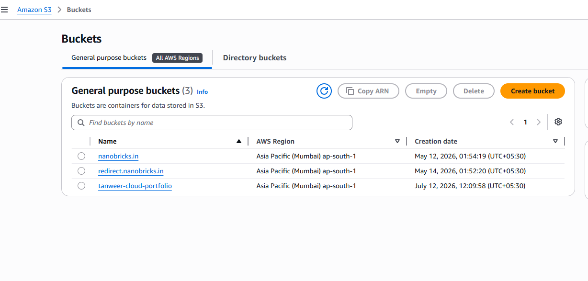
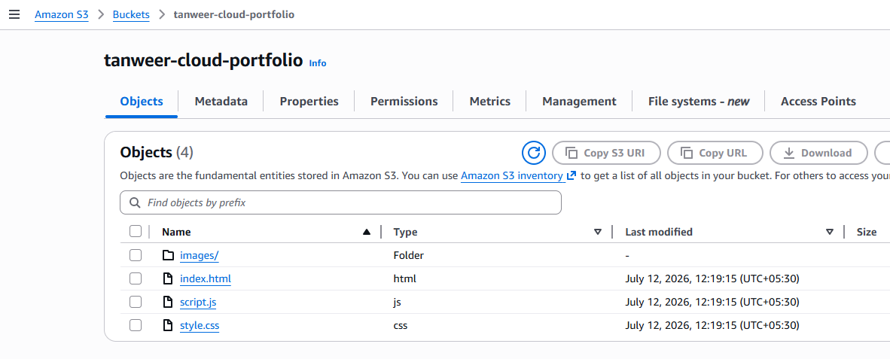
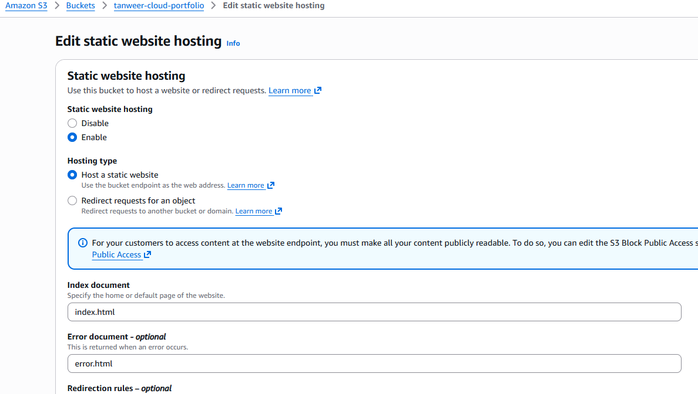
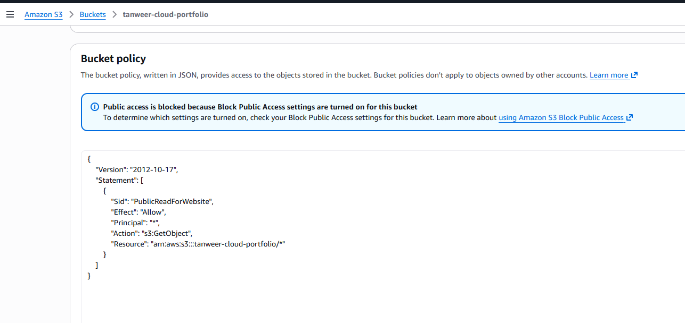
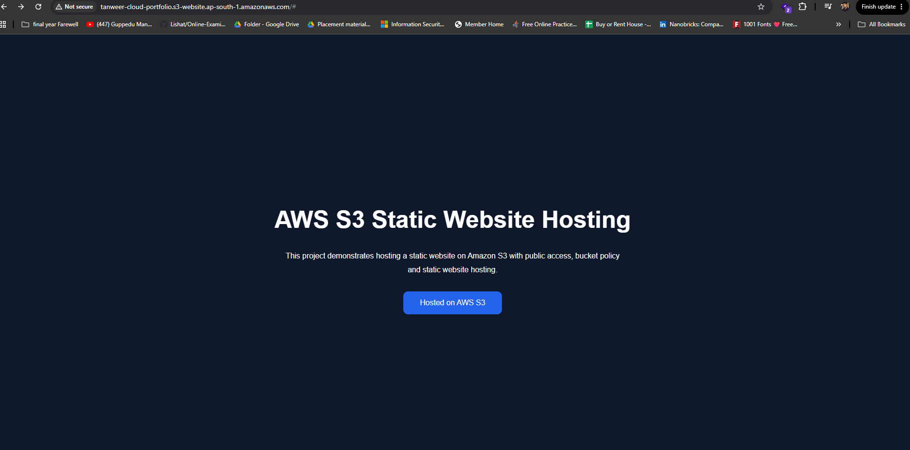

# ☁️ AWS S3 Static Website Hosting

A beginner-friendly AWS project demonstrating how to host a static website using **Amazon S3**.


---

## 📌 Project Overview

This project demonstrates how to deploy a static website on **Amazon S3** using:

- Amazon S3 Bucket
- Static Website Hosting
- Bucket Policy
- Public Read Access
- HTML, CSS & JavaScript

---

## 🛠 Technologies Used

- Amazon S3
- HTML5
- CSS3
- JavaScript
- Git
- GitHub

---

## 📂 Project Structure

```
aws-s3-static-website/
│
├── website/
│   ├── index.html
│   ├── style.css
│   └── script.js
│
├── screenshots/
│
├── images/
│
├── README.md
├── LICENSE
└── .gitignore
```

---

## 🚀 Deployment Steps

1. Create an Amazon S3 bucket
2. Upload website files
3. Enable Static Website Hosting
4. Configure Bucket Policy
5. Disable Block Public Access (Demo Purpose)
6. Access the Website Endpoint

---

## 📸 Screenshots

### S3 Bucket



### Files Uploaded



### Static Website Hosting



### Bucket Policy



### Live Website



---

## 🔮 Future Improvements

- Deploy using Terraform
- Integrate Amazon CloudFront
- Enable HTTPS
- Automate deployment with GitHub Actions

---

## 👨‍💻 Author

**Tanweer Ahmed**

- 🌐 Portfolio: https://tanweerahmed.in
- 💼 LinkedIn: https://www.linkedin.com/in/shaik-tanweer-ahmed/
- 💻 GitHub: https://github.com/shaiktanweer5

---

⭐ If you found this project useful, consider giving it a star.
